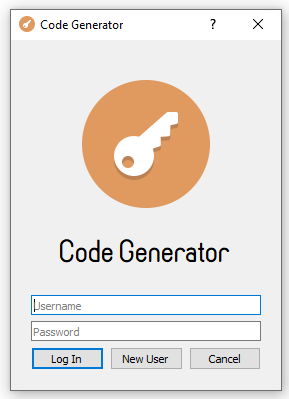
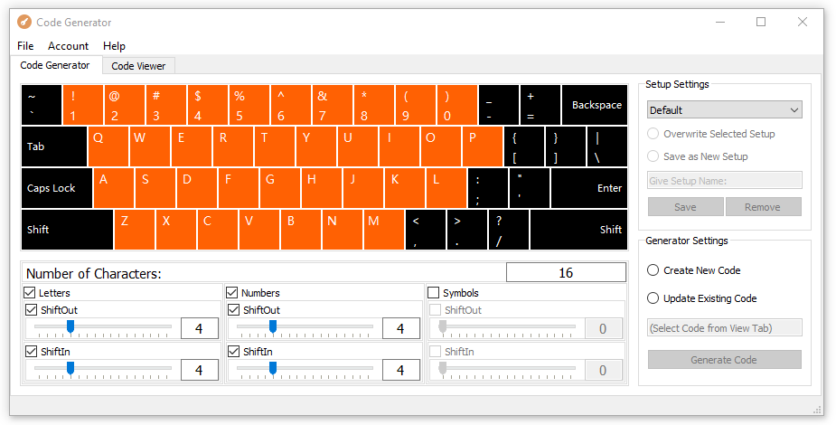
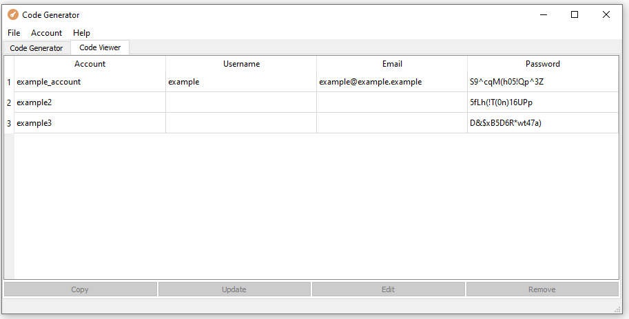
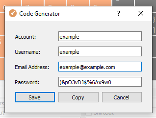
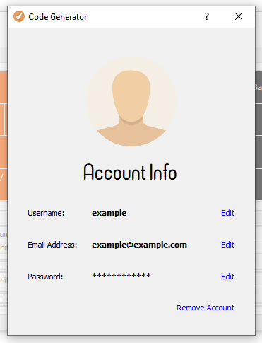

# Code Generator

Code Generator is a desktop application used for password management. It is used for production of strong passwords with
fully controlled criteria, for storing those passwords in MySQL encrypted database and for updating the passwords. It allows
multiple users to manage their own passwords safely.

## User Interface

### Log In Window

  

### Code Generator Tab

  

### Code Viewer Tab

  

### Code Generation Pop Up

  

### Account Management Window

  

